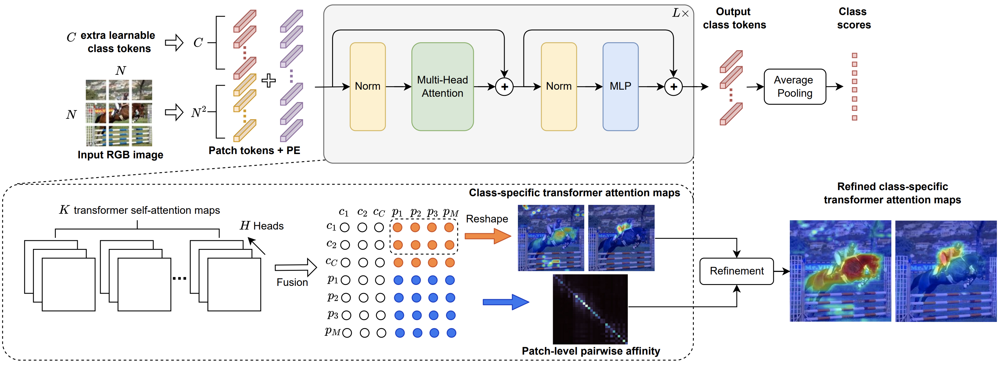

# MCTformer
The pytorch code for our CVPR2022 paper [Multi-class Token Transformer for Weakly Supervised Semantic Segmentation](https://arxiv.org/abs/2203.02891).

[[Paper]](https://arxiv.org/abs/2203.02891) [[Project Page]](https://xulianuwa.github.io/MCTformer-project-page/)

<p align="center">
  
</p>
<p align = "center">
Fig.1 - Overview of MCTformer
</p>


## Prerequisite
- Ubuntu 18.04, with Python 3.6 and the following python dependencies.
```
pip install -r requirements.txt
```
- Download [the PASCAL VOC 2012 development kit](http://host.robots.ox.ac.uk/pascal/VOC/voc2012).

## Usage
Step 1: Run the run.sh script for training MCTformer, visualizing and evaluating the generated class-specific localization maps. 
```
bash run.sh
```
### PASCAL VOC 2012 dataset

| Model        | Backbone   | Google drive |
|--------------|------------|--------------|
| MCTformer-V1 | DeiT-small | [Weights](https://drive.google.com/file/d/1jLnSbR2DDtjli5EwRYSDi3Xa6xxFIAi0/view?usp=sharing)  |
| MCTformer-V2 | DeiT-small | [Weights](https://drive.google.com/file/d/1w5LDoS_CHtDRXgFSqFtPvIiCajk4ZtMB/view?usp=sharing)  |

Step 2: Run the run_psa.sh script for using [PSA](https://github.com/jiwoon-ahn/psa) to post-process the seeds (i.e., class-specific localization maps) to generate pseudo ground-truth segmentation masks. To train PSA, the pre-trained classification [weights](https://drive.google.com/file/d/1xESB7017zlZHqxEWuh1Rb89UhjTGIKOA/view?usp=sharing) were used for initialization.
```
bash run_psa.sh
```


Step 3: For the segmentation part, run the run_seg.sh script for training and testing the segmentation model. When training on VOC, the model was initialized with the pre-trained classification [weights](https://drive.google.com/file/d/1xESB7017zlZHqxEWuh1Rb89UhjTGIKOA/view?usp=sharing) on VOC.
```
bash run_seg.sh
```

### MS COCO 2014 dataset
Run run_coco.sh for training MCTformer and generating class-specific localization maps. The class label numpy file can be download [here](https://drive.google.com/file/d/1_X0vzP4q8xth3tVSR_-uOePBQq9vQLUS/view?usp=sharing). The trained MCTformer-V2 model is [here](https://drive.google.com/file/d/1PnpQWdDvyezzN89LdTHRHE0IZqVG2USh/view?usp=sharing).
```
bash run_coco.sh
```
## Contact
If you have any questions, you can either create issues or contact me by email
[lian.xu@uwa.edu.au](lian.xu@uwa.edu.au)

## Citation
Please consider citing our paper if the code is helpful in your research and development.
```
@inproceedings{xu2022multi,
  title={Multi-class Token Transformer for Weakly Supervised Semantic Segmentation},
  author={Xu, Lian and Ouyang, Wanli and Bennamoun, Mohammed and Boussaid, Farid and Xu, Dan},
  booktitle={Proceedings of the IEEE/CVF Conference on Computer Vision and Pattern Recognition},
  pages={4310--4319},
  year={2022}
}
```
